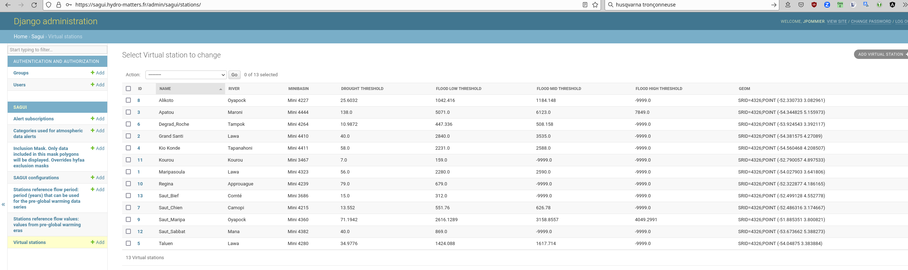
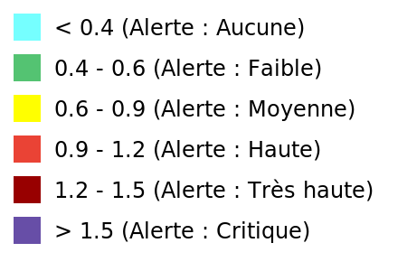

# Alertes 

Les données carto sont réparties en 4 sections : prévisions, alertes de débit, de pluie et atmosphériques. Les boutons sur la gauche de la carte permettent de basculer entre ces quatres compositions carto. Ils donnent aussi un aperçu de l'état d'alerte global (couleur, icône).

Ces informations d'alerte globale sont fournies par le point d'API [https://sagui.hydro-matters.fr/api/v1/dashboard](https://sagui.hydro-matters.fr/api/v1/dashboard)

Selon la thématique choisie, les alertes sur la carte s'affichent différemment :
- Pour les deux premiers boutons, les alertes sont affichées pour des stations de référence. Les informations de débit sont affichées pour tous les tronçons de rivière.
- Pour la pluie, le niveau d'alerte est visible à la couleur des bassins versants. Selon le niveau de zoom, on visualise le sous-bassin ou le mini-bassin
- Pour la pollution atmosphérique, c'est une image raster qui est affichée avec le niveau de pollution en chaque point

Ci-dessous plus de détails sur chacun des modes d'alerte

## Prévisions


### Alerte par station

Accès API : [https://sagui.hydro-matters.fr/api/v1/flow_previ/stations](https://sagui.hydro-matters.fr/api/v1/flow_previ/stations)

Le niveau d'alerte s'appuie sur le calcul d'anomalie. La correspondance se fait via la fonction SQL `guyane.anomaly_to_alert_level` définie comme suit : 
```
CREATE OR REPLACE FUNCTION guyane.anomaly_to_alert_level(flow_anomaly double precision)
  RETURNS text
  LANGUAGE plpgsql AS
$func$
BEGIN
	RETURN (SELECT
			CASE
			  WHEN flow_anomaly < -50 THEN 'd3'
			  WHEN flow_anomaly < -25 THEN 'd2'
			  WHEN flow_anomaly < -10 THEN 'd1'
			  WHEN flow_anomaly > 50 THEN 'f3'
			  WHEN flow_anomaly > 25 THEN 'f2'
			  WHEN flow_anomaly > 10 THEN 'f1'
			  ELSE 'n'
			END AS level);
END
$func$;
COMMENT ON FUNCTION guyane.anomaly_to_alert_level(double precision) IS 
'Get alert level as string, depending on the anomaly level (percentage)';
```

L'anomalie est calculée sur l'écart entre la valeur de la période de référence la plus récente et la valeur actuelle. 

### Alerte globale
Accès API : [https://sagui.hydro-matters.fr/api/v1/dashboard](https://sagui.hydro-matters.fr/api/v1/dashboard)

Elles sont définies dans [https://github.com/HydroMetGuyane-Hydro-Matters/sagui_backend/blob/main/src/sagui/utils/stations_forecast.py#L12-L90](https://github.com/HydroMetGuyane-Hydro-Matters/sagui_backend/blob/main/src/sagui/utils/stations_forecast.py#L12-L90)

Le niveau d'alerte est calculé de la même façon que pour chaque station, en s'appuiyant sur ***la valeur d'anomalie la plus élevée en valeur absolue***.

Des statistiques (`histogram`) sont aussi fournies par le même point d'API. Il s'appuie sur les valeurs de prévision à J+5


### Période de référence 
Ce sont des périodes calculées avec le même algo MGB/HYFAA, sur des données de référence, pré-réchauffement climatique. Elles sont disponibles par décennie. La dernière en date étant donc `2010-2020`.

Elles ne sont disponibles que sur les stations. 

Elles sont utilisées pour les calculs d'alerte. Et affichées dans la visualisation graphique 


## Débits

### Alerte par station
Les niveaux d'alerte de débit sont définis par station. Ils ont été importés dans la plate-forme, et peuvent être modifiés via l'interface d'admin, table `Virtual stations`



Selon les stations, le nombre de niveaux d'alerte disponibles n'est pas le même, ainsi certaines stations n'auront pas de niveau d'alerte inondation élevée (seuil à -9999).

### Codes d'alerte

| code | niveau d'alerte |
|------| -----|
| d2   | Sécheresse moyenne |
| n    | Normal (pas d'alerte) |
| f1   | Inondations, faible |
| f2   | Inondations, moyen |
| f3   | Inondations, fort |

### Alerte globale
Le niveau d'alerte globale s'appuie sur la liste des niveaux d'alerte des stations. Et prend la première valeur rencontrée dans l'ordre suivant : 
`['f3', 'f2', 'd2', 'f1', 'n']`

## Pluie

### Alerte par bassin
Accès API : uniquement en tuiles vecteur 
 - sous-bassins : [https://sagui.hydro-matters.fr/tiles/guyane.rainfall_subbasin_aggregated_geo.html](https://sagui.hydro-matters.fr/tiles/guyane.rainfall_subbasin_aggregated_geo.html)
 - mini-bassins : [https://sagui.hydro-matters.fr/tiles/guyane.rainfall_minibasin_aggregated_geo.html](https://sagui.hydro-matters.fr/tiles/guyane.rainfall_minibasin_aggregated_geo.html)
 - aggrégées selon niveau de zoom : [https://sagui.hydro-matters.fr/tiles/guyane.mvt_rainfall.html](https://sagui.hydro-matters.fr/tiles/guyane.mvt_rainfall.html)

Selon le niveau de zoom sur la carte, on verra soit les sous-bassins soit les mini-bassins. Les aplats de couleur dépendent du niveau d'alerte pour chacun des polygones affichés (codes d'alerte ci-dessous), à la dernière date disponible.

### Codes d'alerte

| Quantité (mm) | code | niveau d'alerte |
| --- |------| -----|
| 0 - 5 mm  | n    | Normal (pas d'alerte) |
| 5 - 20 mm | r1   | Alerte faible |
| 20 - 50 mm| r2   | Alerte moyenne |
| > 50 mm   | r3   | Alerte forte |


### Alerte globale
Elle est déterminée à partir de la valeur de pluie la plus élevée au niveau des **sous-bassins** et utilise les mêmes seuils que ci-dessus.

Un champ `histogram` est fourni en bonus et représente la répartition des **minibassins** selon leur niveau d'alerte.

## Pollution atmosphérique

Accès API : [https://sagui.hydro-matters.fr/api/v1/atmo/files](https://sagui.hydro-matters.fr/api/v1/atmo/files)

### Données quotidiennes
Pour chaque jour, un fichier geotiff est produit par un [processus externe](https://github.com/HydroMetGuyane-Hydro-Matters/atmo_s5p)

Ce fichier, ou plutôt sa version PNG, est affiché directement sans autre transformation.
Il s'agit d'une donnée catégorisée selon des plages de valeurs, listées sur [http://sagui.hydro-matters.fr/api/v1/atmo/classes](http://sagui.hydro-matters.fr/api/v1/atmo/classes).
Il est possible d'éditer ces catégories via l'interface d'admin, table `Categories used for atmospheric data alerts`. Evidemment, les changements ne seront pris en compte que pour les fichiers traités ultérieurement.



### Alerte globale
Le niveau d'alerte globale est calculé sur un sous-ensemble du territoire, défini par un fichier statique (non-éditable, pour l'instant, via l'interface d'admin), [zoi.geojson](https://github.com/HydroMetGuyane-Hydro-Matters/sagui_backend/blob/main/data/zoi.geojson).

Des statistiques sont extraites sur les pixels retenus. L'alerte est définie avec la valeurs `10th_max` : on prend la 10e plus haute valeur et le seuil d'alerte correspondant (on élimine les 9 premières valeurs, pour réaliser un léger lissage).


## Série MGB utilisée

Par défaut, la plate-forme utilise les données avec assimilation. 

Cela peut être changé via l'interface graphique et devrait être mis à jour à la publication de données suivantes (le jour suivant.)